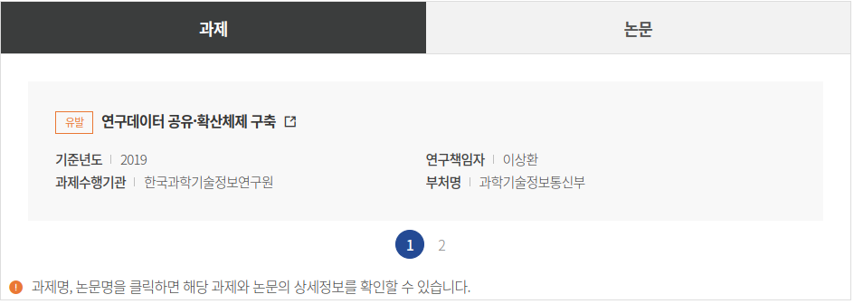
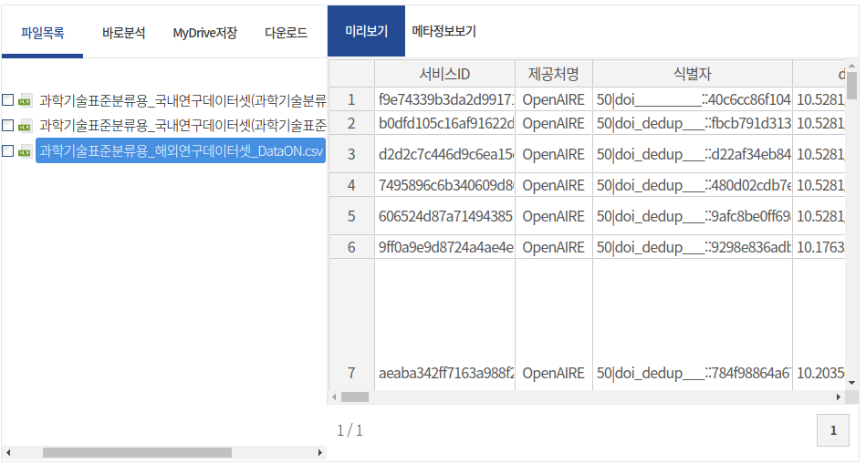

<link href="/resources/neo4jd3/css/neo4jd3.min.css?v=0.0.1" rel="stylesheet"/>

<!DOCTYPE html>

ScienceON 로그 데이터(2022년도)
===

<table>
<tbody>
<tr>
</tr>
<tr>
<th scope="row">제목(Sub)</th>
<td class="text-left"></td>
</tr><tr>
<th scope="row">저자</th>
<td class="text-left">신수미</td>
</tr>
<tr>
<th scope="row">제공처</th>
<td class="text-left">국가연구데이터플랫폼</td>
</tr>
<tr>
<th scope="row">리포지터리</th>
<td class="text-left">국가연구데이터플랫폼</td>
</tr>
</tbody>
</table>
</dd>
</dl>

                                        신수미(한국과학기술정보연구원);

<!-- 03-1. 데이터셋 설명-주언어 해당 (주언어가 없는경우 부언어와 매칭하여 조회) -->

ScienceON(https://scienceon.kisti.re.kr) 의 사용자 행동 예측 문제 해결을 위한 2022년도 ScienceON 시스템 로그 데이터입니다. 데이터의 각 필드는 사용자IP,서비스 종류,콘텐츠 종류,웹/모바일 구분,로그등록시간,이전URL,요청URL,검색질의어,조회 컨텐츠 와 같습니다. UTF8로 인코딩되어 있습니다. 해당 데이터는 2023년 DATA‧AI 경진대회 과학기술문제형의 4번 문제 ScienceON 사용자 행동 예측 문제 해결을 위해 제공되는 데이터 입니다. 로그데이터는 2022년 1월~12월까지의 로그데이터입니다. 파일명규칙은 (연도월_1: 1일~15일치 데이터, 연도월_2: 16일~말일 데이터), (예제: 2201_1.csv 는 22년도 1월 1일~15일까지 로그입니다.)와 같습니다. 
 
  

<h4 class="rstD_title">데이터 생성 이력정보</h4>
<ul class="bul_list embargo_list">
<!-- 05-1. 데이터셋 생성일시 :: creat_dttm -->
<li>데이터등록일: 2023-08-11</li>
</ul>

<h4 class="rstD_title">특성 정보</h4>
<ul class="bul_list" id="charInformation">
<li>주제분류 = 인터넷 S/W </li>

</ul>

<i class="xi-error"></i>
특성정보는 제공처로부터 수집된 데이터이며, DataON에서 제공하는 이외의 정보를 담고 있습니다.

<!-- 데이터셋에 따른 생성자, 기여자, 과제, 논문과의 연관정보를 그래프로 나타냄 -->

<h4 class="rstD_title">데이터셋 의미 관계 정보</h4>

<i class="xi-error"></i>
의미관계가 형성된 정보를 클릭하면 통합검색 결과로 이동합니다.

<i class="xi-error"></i>
본 서비스는 크로미움(Chromium)기반의 브라우저에서만 제공됩니다.

<h4 class="rstD_title">관련 과제/논문 정보</h4>

<i class="xi-error"></i>
관련 과제/논문 정보는 데이터 등록자 또는 이용자가 추천한 정보가 제공됩니다.

<ul>
<li>유발연구데이터가 유발된 과제/논문 정보입니다.</li>
<li>관련연구데이터 생산에 참고된 관련 과제/논문 정보입니다.</li>
</ul>

<ul class="data_tabMenu type2 clear tab_begin">
<!-- 09-1. 과제상세정보 호출 :: ps_service_pjt (ps_service_ctlg와 ctlg_sn매칭하여 과제상세정보 조회) -->
<li>

</li>
<!-- 09-2. 논문상세정보 호출 :: ps_service_pblctns (ps_service_ctlg와 ctlg_sn매칭하여 과제상세정보 조회) -->
<li>

</li>
</ul>

<i class="xi-error"></i>
과제명, 논문명을 클릭하면 해당 과제와 논문의 상세정보를 확인할 수 있습니다.

<!-- 10-1. 파일형태가 'path(=다운로드형태)'인 경우  -->
<!-- CASE1. 파일접근유형이 엠바고(03)이면서 엠바고종료일시가 지나지 않은경우 -->
<!-- 문자열로 비교하는 경우 추후 변경되었을 때 오류가 날 수 있으므로 코드 값으로 구분할 수 있도록 수정 : 비네아 서민진 (22.02.09) -->
<!-- CASE2. 파일접근유형이 공개(01)인 경우 -->
<!-- 문자열로 비교하는 경우 추후 변경되었을 때 오류가 날 수 있으므로 코드 값으로 구분할 수 있도록 수정 : 비네아 서민진 (22.02.09) -->

<h4 class="rstD_title">파일정보</h4>

<i class="xi-error"></i>
본 서비스는 크로미움(Chromium)기반의 브라우저에서만 제공됩니다.

<!-- 10-2. 파일형태가 'lndg(=상세보기형태)'인 경우  -->
<!-- } 데이터셋 상세정보 조회 종료 -->

<!-- Go to www.addthis.com/dashboard to customize your tools -->
<!--  -->

<ul class="rst_count">
<li>
<strong id="view_cnt">529</strong>
<i class="xi-eye"></i>조회수
</li>
<li>
<strong id="download_cnt">64</strong>
<i class="xi-download"></i>다운로드수
</li>
<li>
추천수
<strong id="good_cnt">0</strong>
</li>
<li>
공유수
<strong id="shares_cnt">3</strong>
</li>
<li>
인용횟수
<strong id="citation_cnt">0</strong>
</li>
</ul>
<dl class="rstD_info">
<dt>제공처</dt>
<dd>

</dd>
</dl>
<dl class="rstD_info">
<dt>리포지터리</dt>
<dd>국가연구데이터플랫폼 
</dd>
</dl>
<dl class="rstD_info rstD_info_url">
<dt>DOI<i class="xi-external-link"></i></dt>
<dd>

<a class="rstD_name" href="https://doi.org/10.22711/idr/985" target="blank">10.22711/idr/985</a>
</dd>
</dl>
</main> <!-- } 메인 종료 -->

-
-----

분석 활용 사례
======

개요: 
----

소스:
----

<address>(우)34141 대전광역시 유성구 대학로 245  한국과학기술정보연구원.</address>

문의메일 : dataon@kisti.re.kr

</body>

</html>
