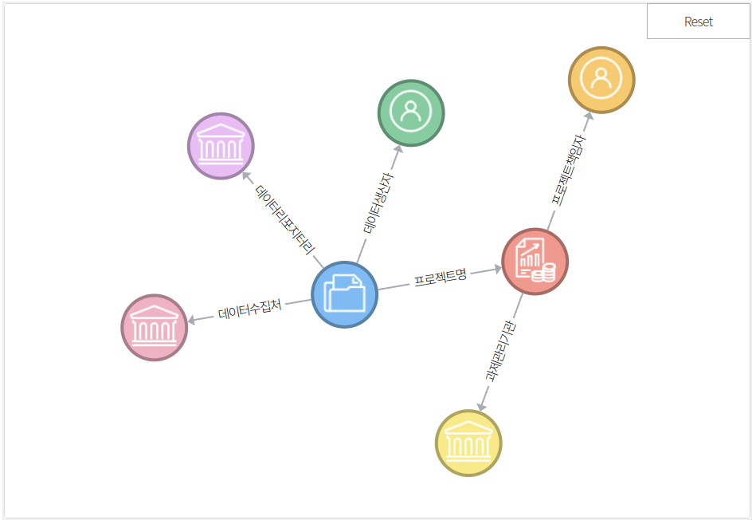
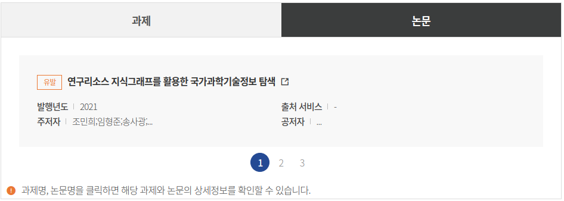

ScienceON 로그 데이터 및 분석 활용 사례
===
 

데이터셋 개요
---

 

<table>
<tbody>
<tr>
<th>저자</th>
<th class="text-left">신수미</th>
</tr>
<tr>
<th>제공처</th>
<th class="text-left">국가연구데이터플랫폼</th>
</tr>
<tr>
<th>리포지터리</th>
<th class="text-left">국가연구데이터플랫폼</th>
</tr>
<tr>
<th width=100> 개요 </th>
<th height=150> ScienceON(https://scienceon.kisti.re.kr) 의 사용자 행동 예측 문제 해결을 위한 2022년도 ScienceON 시스템 로그 데이터입니다. 데이터의 각 필드는 사용자IP,서비스 종류,콘텐츠 종류,웹/모바일 구분,로그등록시간,이전URL,요청URL,검색질의어,조회 컨텐츠 와 같습니다. UTF8로 인코딩되어 있습니다. 해당 데이터는 2023년 DATA‧AI 경진대회 과학기술문제형의 4번 문제 ScienceON 사용자 행동 예측 문제 해결을 위해 제공되는 데이터 입니다. 로그데이터는 2022년 1월~12월까지의 로그데이터입니다. 파일명규칙은 (연도월_1: 1일~15일치 데이터, 연도월_2: 16일~말일 데이터), (예제: 2201_1.csv 는 22년도 1월 1일~15일까지 로그입니다.)와 같습니다. 

</th>
</tr>

</tbody>
</table>

<h4 class="rstD_title">데이터 생성 이력정보</h4>
<ul class="bul_list embargo_list">
<!-- 05-1. 데이터셋 생성일시 :: creat_dttm -->
<li>데이터등록일: 2023-08-11</li>
</ul>

<h4 class="rstD_title">특성 정보</h4>
<ul class="bul_list" id="charInformation">
<li>주제분류 = 인터넷 S/W </li>

</ul>

<i class="xi-error"></i>
특성정보는 제공처로부터 수집된 데이터이며, DataON에서 제공하는 이외의 정보를 담고 있습니다.

 
 

데이터셋 의미 관계 정보
---

의미관계가 형성된 정보를 클릭하면 통합검색 결과로 이동합니다.

본 서비스는 크로미움(Chromium)기반의 브라우저에서만 제공됩니다.

 
 

관련 과제/논문 정보
---
관련 과제/논문 정보는 데이터 등록자 또는 이용자가 추천한 정보가 제공됩니다.
<ul>
<li>유발연구데이터가 유발된 과제/논문 정보입니다.</li>
<li>관련연구데이터 생산에 참고된 관련 과제/논문 정보입니다.</li>
</ul>

관련 과제 정보

관련 논문 정보

과제명, 논문명을 클릭하면 해당 과제와 논문의 상세정보를 확인할 수 있습니다.

 
 

파일정보
---

<dl class="rstD_info">
<dt>제공처</dt>
<dd>

</dd>
</dl>

<dl class="rstD_info">
<dt>리포지터리</dt>
<dd>국가연구데이터플랫폼 
</dd>
</dl>

<dl class="rstD_info rstD_info_url">
<dt>DOI<i class="xi-external-link"></i></dt>
<dd>
<a class="rstD_name" href="https://doi.org/10.22711/idr/985" target="blank">10.22711/idr/985</a>
</dd>
</dl>

-----

 
 

분석 활용 사례
---
블라블라 블라........

앱 개요: 
----

블라블라 블라........

앱 소스코드:
----

    def main():
    # 커맨드 라인 인자 파싱
    parser = argparse.ArgumentParser(description='Convert HTML to Markdown and download related assets.')
    parser.add_argument('html_url', help='URL of the HTML file')
    parser.add_argument('output_dir', help='Output directory for Markdown file and assets')
    args = parser.parse_args()

    # 출력 디렉토리 존재 여부 확인
    if os.path.exists(args.output_dir):
        print('Error: Output directory {} already exists. Please choose a different directory.'.format(args.output_dir))
        return

    # 출력 디렉토리 생성
    os.makedirs(os.path.join(args.output_dir, 'assets'), exist_ok=True)

    # HTML 가져오기
    response = requests.get(args.html_url)
    if response.status_code != 200:
        print('Error: Failed to fetch the HTML content from the provided URL.')
        return

 
 

---

<address>(우)34141 대전광역시 유성구 대학로 245  한국과학기술정보연구원.</address>

문의메일 : dataon@kisti.re.kr

</body>

</html>
